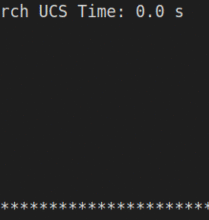

# BotClean Using (Qlearning, BFS, DFS, UCS)

**Solve the BotClean problem using Reiforcement learning and Graph Search frameworks**

**Algorithms used**:
- Breadth First Search 
- Depth First Search
- Uniform Cost Search
- Q-learning (table version)

**Goal :** The Bot needs to make smarter moves to clean the dirty cell on a board/Maze with dimensions HEIGHT x WIDTH.

## install Dependencies:

[docker](https://docs.docker.com/install/)

### Create the Bot container:
```
$ docker build -t cleanbot .
```

### run the Bot container with volume:

```
$ docker run -d -v $PWD/bots_data:/app/data cleanbot
```

### Now check the performance of your Bots:

- To view the logs and figures of the 4 Bots, check the ```./bots_data``` volume, you will find 4 directories:
```
├── BFS_data
│   ├── play_logs.txt
│   └── search_log.txt
├── DFS_data
│   ├── play_logs.txt
│   └── search_log.txt
├── Qdata
│   ├── play_logs.txt
│   ├── rewardsFig.png
│   └── train_logs.txt
└── UCS_data
    ├── play_logs.txt
    └── search_log.txt

```
- **Example of BFS play_log.txt:**


- **Example of Q-learning rewardsFig.png:**


## Command Line Interface:
- Command line interface (CLI), to chose between algorithms
  and change the board/Maze dimensions.

### Create the virtual env (recommended):
```
$ virtualenv -p python3.6 myenv
$ source myenv/bin/activate
(myenv)$ pip install -r requirements.txt
```
### CLI

```
(myenv)$ python bot_clean.py --help
usage: BotClean [-h] [-H HEIGHT] [-W WIDTH] [-a {BFS,DFS,UCS,Qlearning}] [-m]

██████╗  ██████╗ ████████╗     ██████╗██╗     ███████╗ █████╗ ███╗   ██╗    
██╔══██╗██╔═══██╗╚══██╔══╝    ██╔════╝██║     ██╔════╝██╔══██╗████╗  ██║    
██████╔╝██║   ██║   ██║       ██║     ██║     █████╗  ███████║██╔██╗ ██║    
██╔══██╗██║   ██║   ██║       ██║     ██║     ██╔══╝  ██╔══██║██║╚██╗██║    
██████╔╝╚██████╔╝   ██║       ╚██████╗███████╗███████╗██║  ██║██║ ╚████║    
╚═════╝  ╚═════╝    ╚═╝        ╚═════╝╚══════╝╚══════╝╚═╝  ╚═╝╚═╝  ╚═══╝    

Run simulations with differents algorithms and differents dimensions of the board/maze 
to test the performance of your agent.
List of algorithms to use:
	- BFS:       Breadth First Search
	- DFS:       Depth First Search
	- UCS:       Uniform Cost Search
	- Qlearning: Qlearning (table version)

Check your agent's logs/figures of performance in the ./data directory that will
be created after running a simulation. 

optional arguments:
  -h, --help            show this help message and exit
  -H HEIGHT, --height HEIGHT
                        choose the height dimension for the board game
                        (default 8).
  -W WIDTH, --width WIDTH
                        choose the width dimension for the board game (default
                        10).
  -a {BFS,DFS,UCS,Qlearning}, --agent {BFS,DFS,UCS,Qlearning}
                        choose the agent to use for the simulation game
  -m, --maze            boolean argument to generate a random maze for the
                        game

Example usage:
--------------
- Run the game with Breadth First Search agent in a board with dimensions
  HEIGHT x WIDTH:

  	$ python bot_clean.py -H 10 -W 15 -a BFS

- Run the game with Breadth First Search agent in a random maze with dimensions
  HEIGHT x WIDTH:

  	$ python bot_clean.py -H 10 -W 15 -a BFS --maze

- Run the game with Q-learning agent in a board with default dimensions (8 x 10):

	$ python bot_clean.py -a Qlearning

- RUN the game with the default algorithm Uniform Cost Search in a random maze:

	$ python bot_clean.py -H 7 -W 20 --maze

- RUN the game with the defaults args agent(UCS), board dimensions(8 x 10):

	$ python bot_clean.py

```
### Examples:

#### Example 1:
- **Maze with default dimensions (8 x 10), agent (UCS)**
```
(myenv)$ python bot_clean.py --maze -a UCS
```
#### Maze:



#### Example 2:
- **Board (20 height x 20 width), agent (UCS)**
```
(myenv)$ python bot_clean -H 20 -W 20 -a UCS
```
#### Board:


#### UCS Planning:


**State(action, (y, x)):** the state definition in the board/maze

**Hints:** 
- board/Maze indexing starts with 0
- for the Maze problem, because the generation of the maze is random, sometimes the maze is unsolvable. In this case the program will exist and it will print the unsolvable maze.

Example:
```
(myenv)$ python bot_clean.py --maze -a BFS

######--#-
#---#-#-##
#d--##-##-
##--#-###-
#--##--#--
---#-##b-#
--#-#-###-
-#-#-####-

No solution for this maze: Exit

```

## TO DO: 
- Analyse performance between agents in differents board/maze dimensions 