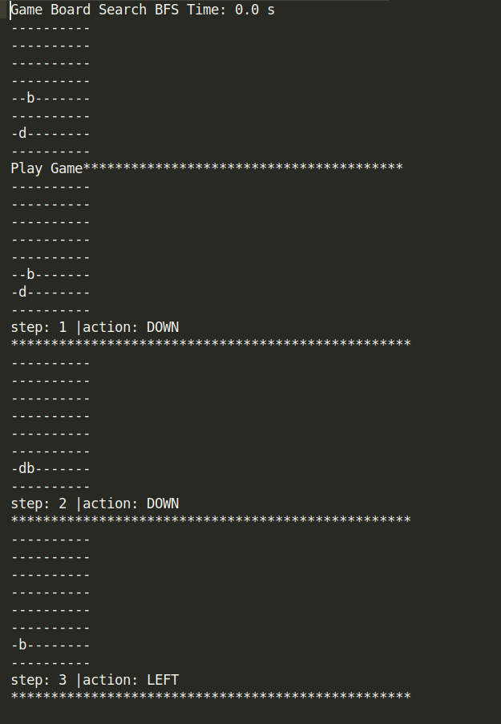
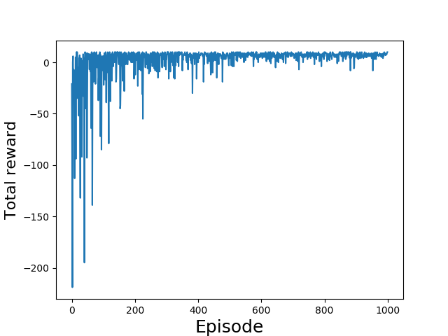
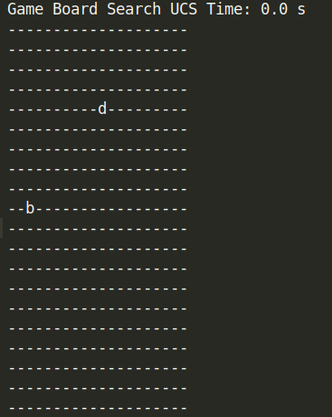
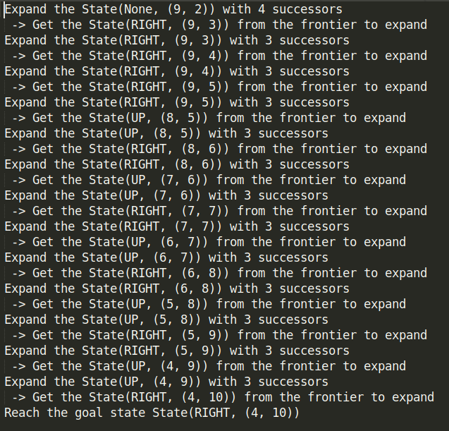

# BotClean Using (Qlearning, BFS, DFS, UCS)

**Solve the BotClean problem using Reiforcement learning and Search graph frameworks**

**Algorithms used**:
- Breadth First Search 
- Depth First Search
- Uniform Cost Search
- Q-learning (table version)

**Goal :** The Bot needs to make smarter moves to clean the dirty cell on a board with dimensions HEIGHT=8, WIDTH = 10

## install Dependencies:

[docker](https://docs.docker.com/install/)

### Create the Bot container:
```
$ docker build -t cleanbot .
```

### run the Bot container with volume:

```
$ docker run -d -v $PWD/bots_data:/app/data cleanbot
```

### Now check the performance of your Bots:

- To view the logs and figures of the 4 Bots, check the ```./bots_data``` directory, you will find 4 directories:
```
├── BFS_data
│   ├── play_logs.txt
│   └── search_log.txt
├── DFS_data
│   ├── play_logs.txt
│   └── search_log.txt
├── Qdata
│   ├── play_logs.txt
│   ├── rewardsFig.png
│   └── train_logs.txt
└── UCS_data
    ├── play_logs.txt
    └── search_log.txt

```
- **Example of BFS play_log.txt:**



- **Example of Q-learning rewardsFig.png:**



## Command Line Interface:
- Command line interface (CLI), to chose between algorithms
  and change the board dimensions.

### Create the virtual env (recommended):
```
$ virtualenv -p python3.6 myenv
$ source myenv/bin/activate
(myenv)$ pip install -r requirements.txt
```
### CLI

```
(myenv)$ python bot_clean.py --help
usage: BotClean [-h] [-H HEIGHT] [-W WIDTH] [-a {BFS,DFS,UCS,Qlearning}]

 ____    ___   ______         __  _        ___   ____  ____  
|    \  /   \ |      |       /  ]| |      /  _] /    ||    \ 
|  o  )|     ||      |      /  / | |     /  [_ |  o  ||  _  |
|     ||  O  ||_|  |_|     /  /  | |___ |    _]|     ||  |  |
|  O  ||     |  |  |      /   \_ |     ||   [_ |  _  ||  |  |
|     ||     |  |  |      \     ||     ||     ||  |  ||  |  |
|_____| \___/   |__|       \____||_____||_____||__|__||__|__|

Run simulations with differents algorithms and differents dimensions of the board 
to test the performance of your agent.
List of algorithms to use:
  - BFS:       Breadth First Search
  - DFS:       Depth First Search
  - UCS:       Uniform Cost Search
  - Qlearning: Qlearning (table version)

optional arguments:
  -h, --help            show this help message and exit
  -H HEIGHT, --height HEIGHT
                        chose the height dimension for the board game (default
                        8).
  -W WIDTH, --width WIDTH
                        chose the width dimension for the board game (default
                        10).
  -a {BFS,DFS,UCS,Qlearning}, --agent {BFS,DFS,UCS,Qlearning}
                        chose the agent to use for the simulation game

Example usage:
--------------
- Run the game with Breadth First Search agent in a board with dimensions
  HEIGHT x WIDTH:

    $ python bot_clean.py -H 10 -W 15 -a BFS

- Run the game with Q-learning agent in a board with default dimensions (8 x 10):

  $ python bot_clean.py -a Qlearning

- RUN the game with the default algorithm Uniform Cost Search:

  $ python bot_clean.py -H 7 -W 20

- RUN the game with the defaults args agent(UCS), board dimensions(8 x 10):

  $ python bot_clean.py

```
### Example:
```
(myenv)$ python bot_clean -H 20 -W 20 -a UCS
```
#### Board:



#### UCS Planning:



**State(action, (y, x)):** the state definition in the board

**Hint: board indexing starts with 0**

## TO DO: 
- Analyse performance between agents in differents board dimensions 